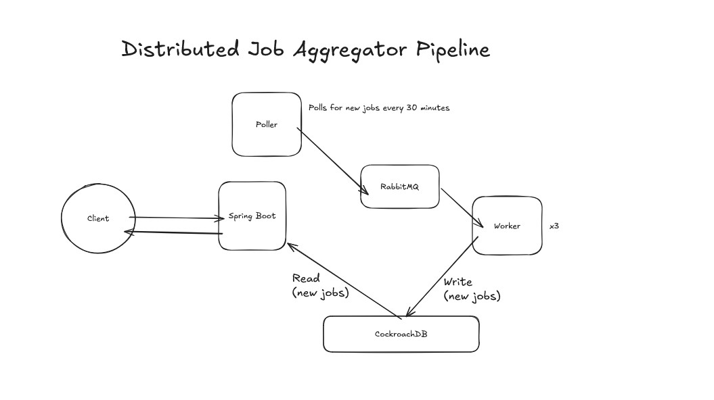

# Distributed Job Aggregator

A distributed job-feed aggregator that polls **11 applicant-tracking systems** (Greenhouse, Ashby, Lever, SmartRecruiters, Recruitee, Workable, Teamtailor, Workday, Remotive, RemoteOK, Arbeitnow) for fresh software-engineering openings and publishes them on a dashboard.

## Architecture

## Tech stack

| Layer | Technology |
|---|---|
| Services | Spring Boot (`backend`, `poller`, `worker`) |
| Messaging | RabbitMQ (competing consumers via Spring AMQP) |
| Database | CockroachDB (Postgres wire-compatible), Spring JDBC |
| Live updates | STOMP over WebSockets (per-user queues via `SimpMessagingTemplate`) |
| Frontend | React 19, Vite |

## API

| Endpoint | Purpose |
|---|---|
| `POST /api/users/signup` | Create an account (returns a JWT — user lands on the dashboard signed in) |
| `POST /api/users/login` | Authenticate, returns a JWT |
| `GET /api/dashboard` | Recent jobs for the authenticated user's subscriptions |
| `POST /api/subscribe` | Update which ATS platforms the user watches |

## Next Steps

- Migrate application to AWS
- Turn CockroachDB to using a multi-node approach